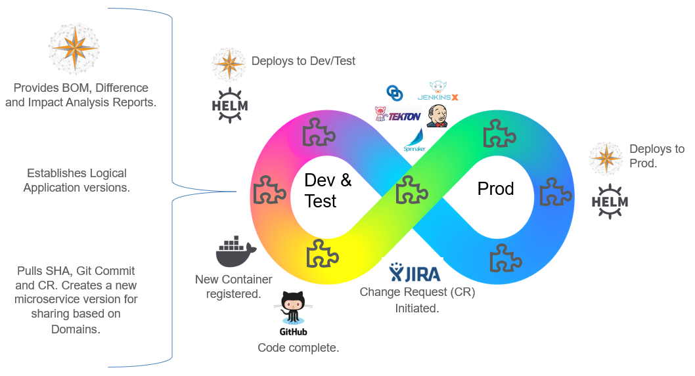
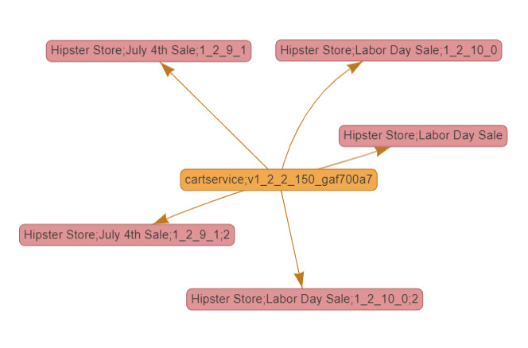
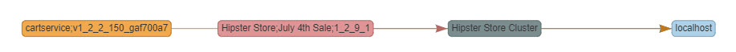
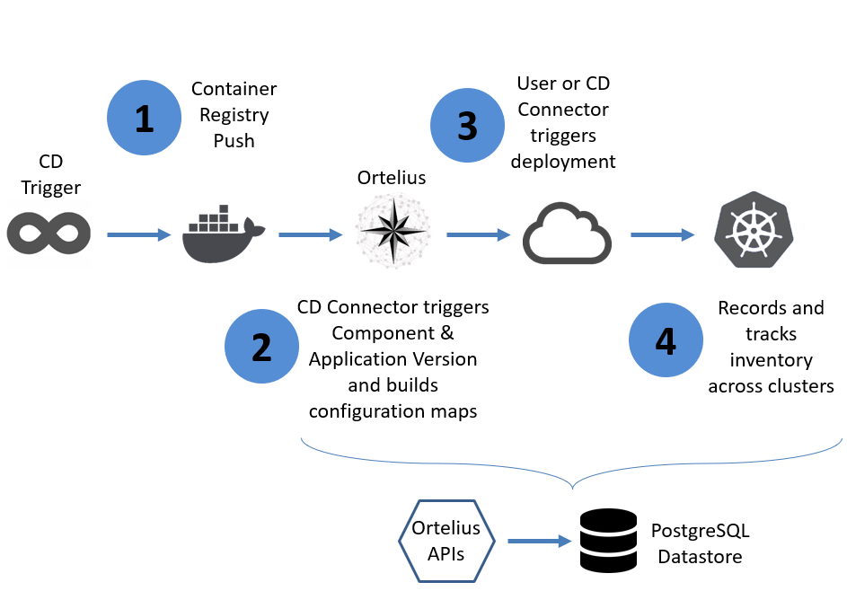

# CD Foundation Proposal for Ortelius

## Name of project

Ortelius

## Summary

### Proposal

As the first open source microservice management platform, [Ortelius](https://ortelius.io) is an excellent project to be incubated by the Continuous Delivery Foundation. For this reason, the Ortelius Open Source community is submitting Ortelius to be added as an incubating project.

Companies of all sizes continue to struggle with achieving a complete continuous delivery pipeline where code is pushed all the way to production on a streamlined continuous basis. With the introduction of microservices, the problem is amplified as more moving parts are pushed to end users at record speeds. Ortelius is designed with a microservice architecture in mind to simplify the organization, sharing and release of microservices and other reusable components. It does so using a domain catalog, a built-in versioning engine, continuous configuration management, and the tracking of cluster inventory for making consistent deployment decisions across the CD pipeline.

 Ortelius is designed to meet the audit demands of operation teams and the control demands of developers supporting both traditional and microservice release models. Ortelius easily integrates with CD orchestration tools and was designed to take advantage of external deployment engines such as Helm, Ansible and Spinnaker.

### Rationale

We believe the CD Foundation is the correct home for Ortelius for two primary reasons.

1) Thought leaders in the continuous delivery space can help guide the release and continuous configuration management features to further drive adoption of full CD.

2) The CD Foundation is the proper home for managing a potential catalog of open source microservices and their deployment meta data for sharing and reuse on a global scale.

Driving adoption of Continuous Delivery practices is a strategic goal of the CD Foundation. The question to ask is "what blocks the adoption of Continuous Delivery?" and "what do end users need to mature CI to full CD?"  While answers may vary between enterprise end users, one common theme tends to repeat itself - the ability to create a consistent deployment approach across the pipeline.

Application Release Automation solutions were designed to address this particular challenge for monolithic releases. However the cost of ARA is often a barrier to adoption leaving the CD pipeline dependent upon scripted solutions to solve the release challenge for dev and test. In these stages, the CD orchestration engine executes deployment scripts to satisfy the release needs of development and testing teams.  Production requires more than just a scripted processes called via the CD pipeline. Production then design their own release tooling which is not part of the CD process. In other words the wall between testing and production continues to stand. In a microservice implementation, the wall must come down allowing for DevOps at scale. To do this the CD pipeline must generate the visibility and audit streams to provide operation teams with the information needed to confidently allow high frequency releases.

Ortelius operates at scale. Key to it's success is the ability to satisfy the tighter audit requirements of production teams without alienating developers who are managing the CD process. In addition, Ortelius can support the release automation requirements of a monolithic approach while providing a clear road-map for managing microservices where high frequency releases are required.

The Ortelius Technical oversight committee includes Google, Netflix, Boeing and Unisys.

### Project Description

Ortelius is a central hub, or catalog, of deployment meta data for managing the configuration of components as they relate to an application version. A component is an artifact that is consumed by an application.  Unique to Ortelius is a backend versioning engine that tracks each component individually so it can be distinctively versioned and associated to consuming application versions. The manner in which Ortelius versions each individual component is particularly important in a microservice architecture. Ortelius uses a Domain Driven Design catalog to simplify sharing of reusable components which helps minimize microservice complexity and sprawl. Ortelius integrates with the CD pipeline to first track configurations automatically, creates visual dependency and impact analysis maps, generates audit trails and then pushes components (like microservices) confidently across all environments using external deployment engines, or its own internal agentless deployment engine.

  
  <strong>
Ortelius and the CD Pipeline</strong>

### Microservices Catalog

Ortelius includes a domain structure that organizes shareable components, like microservices, across siloed teams.  This feature should be further expanded to include a 'Global' catalog where open source microservices can be organized and shared across the world, in a hosted SaaS environment. This allows teams to easily consume open source microservices with their deployment meta data, and release them into their private clusters. This process is similar to what we do today with open source libraries, but in a method that meets the needs of a cloud native approach.

### Microservice Management Platform

Microservice management will be an integral part of the CD process as monolithic applications are broken apart into smaller pieces.  Ortelius tracks the smaller pieces and how they relate back to their consuming applications providing detailed reports on microservice dependency management and usage.   Ortelius serves as a microservice management platform, centralizing the sharing of microservices, tracking the consuming applications with their impact, and managing their inventory across clusters.

  
  <strong>
Microservice to Logical Application Impact Map</strong>

  
  <strong>
Logical Application Difference Map based on Cluster</strong>

### Ortelius Ease of Use

Ortelius was built with easy of use in mind:

- Ortelius plugs into CI/CD tools (Jenkins, TeamCity, CircleCI, Google CloudBuild, Puppet Relay) to enable continuous configuration management, component versioning, auditing and deployment tracking supporting monolithic, hybrid and microservice architectures.
- Ortelius supports database updates as part of the deployment process allowing DB updates to be included in CD.
- Ortelius integrates with any external deployment engine such as Helm, Spinnaker and Ansible, or its own agentless deployment engine can be used.
- Ortelius adds the application version back into a microservice architecture. 
- Ortelius generates configuration data including bill of material maps, impact analysis maps and difference mapping across clusters.
- The Ortelius Domain Driven Catalog facilitates microservices reuse across business silos.
- Ortelius simplifies the migration to microservices from monolithic architectures by providing a central hub of microservices with their deployment meta data and usage.

### Architecture

Ortelius is written Java, JavaScript, C, C++ and Python. It uses a PostgreSQL database to support the catalog, component inventory, and for its unique ability to perform versioning with 'chaining' which enables the incremental dependency mapping.  

  
  <strong>
Architecture Diagram</strong>

## Origin and History

The goal of the Ortelius team was to re-imagine how software would be managed across the CD pipeline for microservice architectures. With the belief that organizations will be required to achieve faster and more consistent software updates, the team understood that a more 'incremental' and 'risk adverse' approach to managing software updates was required as well as clear audit visibility into configuration data across environments (clusters). This led to the creation of the Ortelius domain structure combined with a versioning engine to support continuous configuration management that could be passed to the deployment engine. With this basic understanding, the team knew that a disruption of traditional application release automation was required.

The team also began to understand that shareable components needed a method of organization and versioning.  The domain structure led to the creation of the domain catalog allowing a management system that encouraged sharing and reuse of shareable components across teams, with a central hub of deployment meta data to ensure a shared component was always released consistently. Ortelius was designed to handle the complex relationships that arise from microservices while supporting monolithic releases with fewer moving parts.  With microservices we began to understand that their complexity needed to be resolved.  In particular the ability to track the "logical" view of the application, understand microservice impact and the ability to track the different versions of microservices installed across ALL Kubernetes cluster was needed to simplify a microservice approach and to offer a solution that could be embraced by both development and operation teams.

Ortelius was written by a small team of deployment specialist on behalf of OpenMake Software, originally called DeployHub.  It was released as an open source offering by OpenMake Software in March of 2017 as an overall strategy to deliver an open source offering to companies looking to adopt continuous deployment.  OpenMake spun up DeployHub, Inc in March of 2018 to take DeployHub Pro to market based on the Open Source core. In March of 2019, the DeployHub open source repository was renamed by OpenMake Software to Ortelius in order to create a clear distinction between the open source project and the DeployHub Pro branch.  

Ortelius was named after [Abraham Ortelius](https://en.wikipedia.org/wiki/Abraham_Ortelius) known to be the first person to create a world Atlas, a fitting name for a solution designed to version, configure and map components, like microservices, running across many environments (Physical, Cloud, Clusters).

## Statement on Alignment with Foundation Charter's Mission

The CD Foundation’s strategic goals include driving the adoption of continuous delivery. Ortelius fits into this strategy by providing a solution that adds configuration, audit and visibility of software updates to the CD pipeline satisfying the requirements of operation teams while also providing developers the control they need. Ortelius addresses one of the biggest obstacles to achieving full continuous delivery, creating the clear insights needed by operation teams to confidently embrace the developer driven CD pipeline. We developed Ortelius to evolve the continuous delivery pipeline to support DevOps at scale for both monolithic and more critically microservice architectures.  Ortelius is CI/CD tool agnostic, supports any type of development language, and interacts with any cloud provider.  Ortelius can fit into existing CD pipelines without the need to replace the existing deployment scripts.  

### Continuous Delivery Vs. Continuous Deployments

Ortelius is not a continuous delivery solution, meaning it was not written to orchestrate the software development lifecycle.  Ortelius enables continuous deployments by providing the insights needed to support the update of independently deployed components, like microservices, by way of its automated configuration management, built-in component and application versioning, calling of external deployment engines, and tracking environments to component inventory. Ortelius  provides the insights needed for teams to make data driven decisions about their release strategy. Ortelius also includes an internal, agentless deployment engine that supports database updates and can be used for releases if another deployment engine is not available.  

### Ortelius Benefits to Existing CDF Projects

Ortelius offers 3 basic benefits:

1) Organizes microservices into domain driven design patterns for easy sharing and collaboration.

2) The collection of artifact metadata, such as Docker Digest, Git Commit, Docker Registry, Git Repo, and the Docker Tag to use in versioning of the unique artifact being pushed across the CD pipeline.

3) The automation of Continuous Configuration Management. Ortelius creates a new component version based on the above metadata, and then creates a new application version for all applications consuming the updated component. This relationship management provide the data needed for generating dependency maps, difference maps, impact maps and Bill of Material maps.

4) Deploys, pushes and/or tracks deployments:
    - A - Deploys.  Ortelius can perform the deployment supporting any deployment model (canary, blue/green etc.)
    - B - Pushes. Ortelius can push deployment data to an external deployment engine. It generates YAML files for passing the data to external engines.
    - C - Tracks. Ortelius can track what an external deployment engine performs for inventory discovery across environments.

The end result is to perform automated configuration management prior to any deployment. The configuration management brings visibility into the potential risk, success or failure of a deployment. It creates component dependency relationships so API/microservice developers can see who is consuming their product. Application teams are informed of a new component version  being pushed across environments that may impact their application. SRE and Operation teams are provided with the critical insights needed to allow the CD pipeline to continuously deploy updates.

### Ortelius Connectors to CDF Projects

- Jenkins and Jenkins X benefit from all of the basic benefits listed above.

- Spinnaker would utilize 1, 2, 3, 4B and 4C.

- Tekton would benefit from all of the basic benefits listed above.

- Screwdriver would benefit from all of the basic benefits listed above.

## Growth Plan

The Ortelius growth plan includes an objective but clear leadership team that includes Tracy Ragan (CDF Board Member and CEO of DeployHub) and Steven Taylor, CTO of DeployHub.  Marky Jackson, Jenkins Committer and OpsMX Open Source Director will serve as the initial Community Manager and Coach to ensure the open source community follows strong community building practices.  In addition, the project will focus on building diversity in the community encouraging both women and minorities to get involved regardless of their level of open source committer experience.  Both University outreach and outreach to non-profits dedicated to teaching computer programming to women and minorities will be included in our community building efforts. A continued focus on building relationships, fostering trust and creating engagement for the community will be key to our strategy and success.

The Ortelius team has engaged in an aggressive marketing campaign to build the Ortelius Open Source Community. The campaign includes outreach to Site Reliability Engineers, Cloud Architects, Release Train Engineers, Agile Scrum Coaches, Microservice Developers and Software Engineers. The campaign involves a combination of outreach to OpenMake Software and DeployHub customers and contacts as well as the use of LinkedIn.

The first official community meeting of Ortelius was held on July 21st, 2020.  Since that time we have grown our list of members to 73 with 20 of them having created their first pull request.  We know this is a small number today, but an amazing start.  We have two women who will be acting as Co-Community Managers under the mentorship of Marky Jackson. Currently we hold meetings weekly which includes a General Community meeting on ever other Tuesday at 7 AM PT/ 10 ET.  The following week we hold two SIGs, Outreach SIG on Mondays 7 AM PT and Architecture on Thursdays 7 AM PT.  Members represent various countries including South Africa, India, Germany, UK, Turkey, Mexico, Canada and the US.

## Link to *current* Code of Conduct (if one is adopted already)

[Code of Conduct](https://github.com/ortelius/ortelius/blob/master/CODE_OF_CONDUCT.md)

## Sponsor from TOC, if identified (a sponsor helps mentor projects)

Tara Hernandez - [@tequilarista](https://github.com/tequilarista)

## Project license

GNU Affero (This will be changed on acceptance into the CDF)

## Source control (GitHub by default)

[Ortelius GutHub Repo](https://github.com/ortelius)

## Issue tracker (GitHub by default)

[Ortelius Main Issue Page](https://github.com/ortelius/ortelius/issues)

## External dependencies (including licenses)

[Ortelius Dependencies and Licenses](http://docs.ortelius.io/userguide/licenses/)

## Release methodology and mechanics

We are in the process of moving all components to have ``<component name>;v<schemantic>_<build number>-g<short git sha>`` as the versioning format.  The docker images will be tagged with this versioning schema and also tagged based on the branch they are being built from.  The logical application version format is ``<application name>;<variant>;v<schemantic>_<minor application version>``.  Component versions are packaged together into application versions in Ortelius.  Ortelius is used to manage the configuration and deployment of Ortelius.  

Ortelius is deployed to Kubernetes on Azure for testing and for SaaS access by users.  In addition, on-perm "monolithic" docker images are available.

### Example Flow

- Git commit to master branch trigger Google Cloud Build
- Google Cloud Build
  - docker build and tag with version string
  - docker push tag to quay.io/organization/ortelius
  - Ortelius new Component version to capture details about new image
  - Ortelius new Application version to include new Component Version
  - Deployment approved and pushed to the GKE Cluster.

### Monolithic Images

These images are built by Google Cloud Build and pushed to Quay but they are not used in the Kubernetes Cluster.  These images are used for on-prem installs.

## Names of initial committers, if different from those submitting proposal

Initial committers are same as ones submitting proposal.

## Briefly describe the project's leadership team and decision-making process

[Steve Taylor](https://github.com/sbtaylor15) is the Ortelius product owner at DeployHub and is responsible for leading the primary development effort. 

Steve's Bio: Steve Taylor is seen as a visionary and industry leader in the area of microservices, Istio, Kubernetes, DevOps process improvement, software build and release, and configuration management. Steve was designing continuous delivery pipelines for Fortune 1000 companies before the term ‘continuous integration’ was ever used.  He is the  master mind behind OpenMake Meister, a build automation solution that has served its customers for over 20 years.  Steve is also the architect of DeployHub, the first microservice management platform that also versions and maps microservices and their configurations. Steve is the primary contributor to Ortelius, the open source solution for microservice configuration management, and serves on the Tekton project with Google.  He is driving the Oretlius feature map to support the new challenges that microservices create, particular to the Kubernetes pipeline.

Prior to DeployHub, Steve was the Chief Architect and CFO of OpenMake Software where he was committed to keeping the Meister Build automation solution relevant to its’ 400+ customers, as well as  keeping the company’s financials sound and without the need for outside investment.  Steve leads a lean team of software developers that can achieve more than most large teams.

[Tracy Ragan](https://github.com/TracyRagan) Executive Director and Outreach.

Tracy's Bio: Tracy is CEO and Co-Founder of DeployHub. She is expert in configuration management and pipeline life cycle practices with a hyper focus on microservices and cloud native architecture. She currently serves as a board member of the Continuous Delivery Foundation (CDF) where she is the elected General Member Representative. Tracy is a recognized evangelist in microservices and the continuous delivery pipeline. She is the creator of the Continuous Delivery Foundation Interactive Landscape, a blog contributor for the CDF and speaks at many DevOps events such as CNCF’s KubeCon and CloudBees DevOps World. Tracy is also a DevOps Institute Ambassador and speaks at AWS Marketplace webinar educational events. She is the leader of the New Mexcio CI/CD Foundation Meetups. Prior to DeployHub, Tracy was the COO and co-founder of OpenMake Software, a build acceleration and management tool that is the heart of development for over 400 enterprise development teams. She served on the Eclipse Foundation Board as a founding member from 2004 -2007. Tracy was recognized as a Women In Technology (WIT) Honoree for her work in the DevOps area. You may also find her as an expert panelist on Webinars along with some of her friends at GitLab and CircleCI, or quoted in SD Times articles around DevOps subjects.

#### Ortelius Community
Ortelius meets bi-weekly for an overall project status meeting.  Smaller working groups, Architecture/Catalog and Outreach, for the subcommittees meet biweekly as well. The smaller SIGs is where decision making is done. Additional, smaller working group meetings will be added when appropriate.  All of the meetings take place via Zoom and are published to YouTube and meeting minutes are available on Google Docs.  These meetings are open up to the public for transparency and collaboration. Following are the Ortelius meeting notes and recordings.  

- [General Meeting Minutes](https://docs.google.com/document/d/1cd69CZWMLGtO9gFNQ0mCfiET5aHmM1TwU10My5i7SyY/edit?usp=sharing)
- [Meeting Recordings Youtube](https://www.youtube.com/channel/UCw2LfF0mqkaXdvqfVnIPWmw)

Subcommittee details can be found at
[Ortelius Repository](https://github.com/ortelius/ortelius/blob/master/README.md).

## Link to any documented governance practices

- [Contributing Guidelines](http://docs.ortelius.io/userguide/contributing)

## Preferred maturity level (see stages below)

Incubation

## List of project's official communication channels (slack, irc, mailing lists)

- [Discord](https://discord.gg/ZtXU74x)
- [Google Groups](https://groups.google.com/g/ortelius-dev)
- [YouTube](https://www.youtube.com/channel/UCw2LfF0mqkaXdvqfVnIPWmw/playlists)
- [Twitter](https://twitter.com/OrteliusOs)
- [LinkedIn Group](https://www.linkedin.com/groups/13835566/)

## Link to project's website

- [Homepage](https://ortelius.io)
- [Documentation](https://docs.ortelius.io)

## Links to social media accounts

- [YouTube](https://www.youtube.com/channel/UCw2LfF0mqkaXdvqfVnIPWmw/featured)
- [Twitter](https://twitter.com/OrteliusOs)
- [Discord](https://discord.gg/ZtXU74x)

## Existing financial sponsorship

Project infrastructure is sponsored by DeployHub using the Microsoft Startup Program. The core committers are DeployHub employees.

## Infrastructure needs or requests

Ortelius is a multi-tenant SaaS offering with the ability to host a library of open source microservices. The hosting of Ortelius by the CDF can be discussed and would be helpful to build the microservice library in a vendor neutral space.
