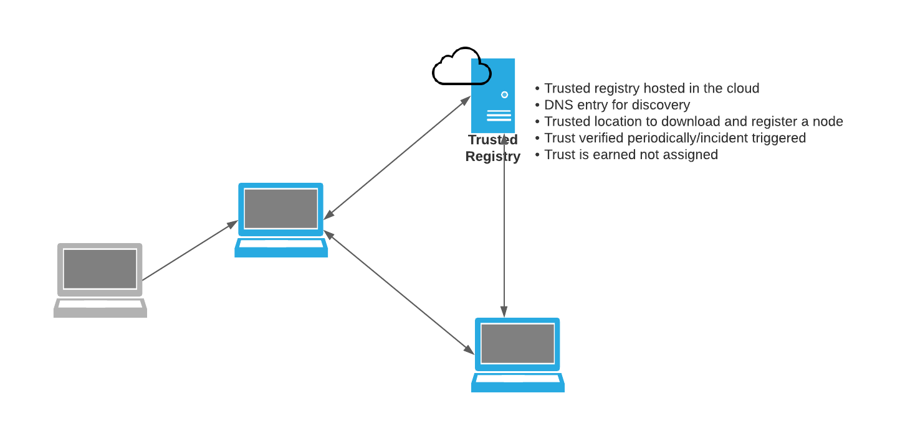

# Project Proposal for Pyrsia - Decentralized Package Network

## Project Description

[Our presentation at LFMS 2021](https://lfms21.sched.com/event/61b18d626d367d34eb85e0c86e65bfb6)

### State of Supply Chain Security

At various conferences this year, Supply Chain Security has been the most talked about subject. We care about improving the security of open source software and supply chain security of these libraries that are critical for software development.

Our proposal for Pyrsia, a decentralized package network, aims to provide a solution for a key part of the supply chain. Pyrsia aims to

1. Build trust for the open-source packages being used as dependencies in software development through certified and peer-verified builds
2. Provide a decentralized package network that understands package coordinates, semantics, and discoverability, and which continues to work even though there are local outages

If the open-source supply chain was compared to an electric power delivery system, it would be analogous to the power grid that supplies distributed electricity to consumers and businesses worldwide. Individuals, small businesses, and enterprises all depend upon reliable delivery of clean power from upstream production sources. The distributed nature of the power grid makes it possible to have a reliable source of power that efficiently distributes electricity production. Without this critical infrastructure it would be impossible to keep production working globally.

[^1]

Similarly, open-source software plays an essential role in the supply chain of modern software development. Proprietary software is typically composed of 90% or more open-source dependencies, with heavy usage on packages provided from one or more central repositories including Maven Central, PyPI, RubyGems, NPM, Docker Hub and others. Outages in these upstream repositories have the potential to produce disruptions in the software supply chain that range from developer productivity to CI/CD build failures to interruption of production releases. Worse yet, security issues in central repositories can have a devastating impact on downstream systems, especially where malicious packages have been injected.

Pyrsia aims to secure the software supply chain of open-source dependencies by creating a system that secures open-source builds and distribution by design.

### Establishing and Verifying Trust in Packages

Today, trust in packages is based on the service(s) that built and/or host those packages. Whenever such a service goes down or is attacked it makes the entire network downstream unstable. Either you cannot continue to build and release software or have the risk of systems with the compromised packages. We trust the service provider to fix and provide proof of trust. This proof of trust is not verifiable by a third party and identifying vulnerable packages is a manual process.

Pyrsia solves this problem by applying automation to both building and verifying trust in the packages hosted/produced on the network. Pyrsia also aims to provide resilience which helps in healing a partition and reestablishing trust in the system.

#### Pyrsia consensus

Pyrsia network works on random consensus across the network. Each package submitted to the network gets built by a random selection of nodes which build and produce the output package independently. The result is then verified by consensus among these nodes. If the verification succeeds the package is then committed to the network and available to be downloaded and deployed.

Random selection allows independent verification of builds and also provides a safety net against network attacks.

#### Goals of Pyrsia

1. Focused on building and distributing open source codebases - source code must be available and accessible at a public location
2. Easy to install and use Pyrsia software with a first-class command line interface that enables developers to gain the benefits of Pyrsia without the need to rewrite existing scripts, docker files etc.
3. Efficient usage of resources for running Pyrsia nodes where contributors are able to dedicate resources to the network based on their constraints
4. Ability to work offline where dependencies have been previously synchronized and cached locally
5. Pyrsia is limited to addressing C, D, E, F, G, H for all open source software as shown the diagram below from [https://slsa.dev/](https://slsa.dev/)
    1. C - Modified code after Source Control
    2. D - Compromised Build Platform
    3. E - Using a Bad Dependency
    4. F - Bypassed CI/CD
    5. G - Compromised Package Repo
    6. H - Using a bad package

#### Non-Goals of Pyrsia

1. Re-invent technologies and software that already exist in other open-source projects
2. Invest in security research on signature technology to sign software packages
3. Support Pyrsia-like functionality for closed source projects

### Pyrsia Building Blocks

#### Pyrsia builder node

A Pyrsia builder node as shown below provides infrastructure to independently build packages from source. When a user submits a candidate to be built(in the form of a URL with the commit hash from source control) each Pyrsia node providing the build service will create an independent containerized environment to build that package.

Once built multiple Pyrsia nodes will verify the result and commit it to the distributed ledger for later verification by downloaders. Committing a reference of the result to the ledger also helps to provide a tamper proof way to record packages and their provenance.

#### Distribution on Pyrsia

Pyrsia nodes collaborate to distribute packages that are large. In distributing large packages Pyrsia nodes will leverage the network to parallelize the downloads to provide better throughput. In the diagram below, the CLI requests a package and Pyrsia nodes stream the stripes of that package over the network to the requestor.

#### Running a Trusted Node

Pyrsia will also provide a way for the community to trust already trusted providers of packages. The established package registries(eg. Dockerhub, go.dev, ubuntu package registry…) can connect to Pyrsia as a trusted registry and provide packages to the downloader. Pyrsia can provide a mechanism to improve the throughput of these downloads by providing locality based caching (if your teammate located on the same network as you downloaded a package, you should not need to go to the internet to download the same package). These downloads can be parallelized as mentioned before. As shown below the Trusted registry continues to be trusted and the network provides resilience in the case when Trusted registry becomes unavailable.

### Building Pyrsia

JFrog is starting to build Pyrsia([https://github.com/pyrsia](https://github.com/pyrsia)) and would like support from the community. The JFrog team also has great ideas to start but are looking for collaboration with the community to make these ideas real.

Given the technical challenges and the need to keep Pyrsia a safe network (safe from attacks, safe from centralization or siloing) we are looking at community members to sponsor and build with us.

The first build of Pyrsia will contain support for limited package types. The architecture is geared to support essential interfaces so as to encourage the community to build/contribute code to support different package types.

### Supporting Pyrsia

We believe that supporting Pyrsia requires a partnership. Governing such a network should be done in a transparent manner to maintain trustworthiness of the network.  JFrog is committed to matching effort and funds to support Pyrsia and is inviting partnerships to make this possible.

On a continuing basis we also propose establishing a collaborative governance structure to oversee the processes followed to continue growing and maintaining the network.  This governance structure will also be the first line of communication for all the users of the network.

### Keeping the trust in Pyrsia

Partners providing services (for Trusted Registries) will need to be certified by a Governance board.

Certification process will include an audit of:

1. Hosting and Infrastructure stack for the Pyrsia trusted registry
2. DevOps practices to deploy and manage such infrastructure
3. Security practices to verify and fix any attack vectors that would compromise this registry or the attached network

Each partner will need to be certified before joining the network. This certification will need to be renewed half-yearly.

An incident (attack on the network or attack on this registry or attack on the contents served by this registry) will retrigger a recertification process. Unless this recertification is completed the service will not be allowed to join the network.

### Pyrsia Trust Model

* Highest level of trust is builds that have been verified by a quorum of regular nodes plus at least two trusted nodes. These must be reproducible.
* Next level of trust is builds that have been verified by a trusted node. These do not have to be reproducible.
* Builds that have been verified by a quorum of regular nodes but have not yet been verified by a trusted node are not considered trusted.

#### Role of Reproducible Builds

* Open-source projects must be reproducible to be built on the Pyrsia network (except if a trusted node chooses to build a non-reproducible library).
* Reproducible builds that have been verified on the network give the highest level of trust possible.
* As a result, Pyrsia provides positive incentives for open-source projects to adopt reproducible build technology.

### Growing the Pyrsia Network

Partners will also be able to contribute via engineering, design, documentation, community engagement efforts to help widen the network.

Partners will also be able to contribute by enhancing support for different package type and build on top of Pyrsia codebase.

Partners will also be needed to support the network where weak/strong network activity is observed - so that they are able to measure the load and adjust resources accordingly.

#### Pyrsia in context - Supply Chain Security

The following efforts are in the same space as Pyrsia and we hope to reuse and get inspired by these efforts. Although, we do not see a clear overlap with Pyrsia’s goals.

* [SigStore](https://www.sigstore.dev/)
* [GitBom](https://github.com/git-bom)
* [TUF](https://theupdateframework.github.io/specification/latest/)
* [Notary V2](https://github.com/notaryproject/notaryproject)
* Notary TUF
* [in-toto](https://github.com/in-toto/in-toto)
* Reproducible Builds
* Alpha-Omega
* nix
* trustix

Pyrsia intends to leverage some or all the technologies being built as a result of the above projects. As we mentioned above, the Pyrsia aims to address the infrastructure and flow of packages as shown in the SLSA.

Pyrsia will leverage reproducible builds to provide provenance as well as portable builds - as this becomes a prerequisite for scaling Pyrsia network.

Pyrsia furthers the Liquid Software vision which is similar to the framework being worked on as part of TUF.

Pyrsia needs the framework proposed by in-toto to empower contributors and open source developers to leverage Pyrsia for distributed packages and updates to those packages.

Pyrsia will build on top of these technologies, so that it delivers a scalable and trustworthy network for building and delivering packages.

## Alignment with CDF Charter Mission

* See Charter in the [Governance Document](https://github.com/pyrsia/pyrsia/blob/main/docs/get_involved/governance.md)

## Code of Conduct

* [Link to Code of Conduct](https://github.com/pyrsia/.github/blob/main/code-of-conduct.md) - Based on OpenSSF and Contributor Covenant.

## TOC Sponsors

* Steve Taylor
* Sponsor 2

## Project License

* [Link to Project License](https://github.com/pyrsia/pyrsia/blob/main/license) - Under the Apache 2 license.

## Source Code Control

* [Link to Source Code Control](https://github.com/pyrsia) - Main repo is pyrsia.

## Issue Tracker

* [Link to Issue Tracker](https://github.com/pyrsia/pyrsia/issues)

## External Dependencies

* [Dependencies and Licenses](pyrsia-deps.md)

## Release Methodology and Mechanics

* Github Actions are used to build the code on a PR merge.  Checks have been enabled to enforce: Linting, Inclusive Naming, Code Coverage, Test Cases and CLA.  Two reviewers must approve the PR for it to be merged.  Once a PR is merged a build is performed for Ubuntu and OS/X.  The Ubuntu binaries are uploaded to the [Pyrsia Debian Repo](https://repo.pyrsia.io) for installation using apt-get.  The nightly repo will contain all PR merges.  The stable repo is populated when a GitHub release is created. Pyrsia follows the schematic naming convention.

## Initial Committers

* Abhijith Ganesh (@AbhijithGanesh)
* Sudhindra Rao (@betarelease)
* Christian Bongiorno (@chb0github)
* Chris Crone (@chris-crone)
* Elliott Frisch (@efrisch)
* Erwin Morrhey (@erwin1)
* Xuefei Han (@fishseabowl)
* Fred Simon (@freddy33)
* Baruch Sadogursky (@jbaruch)
* Johan Vos (@johanvos)
* José Pereda (@jperedadnr)
* Justin Cormack (@justincormack)
* Amir Shmulevich (@karma665)
* Markus Binder (@markus-jf)
* Mitali Bisht (@MitaliBo)
* Mark Seaborn (@mseabornIBM)
* Chris Mc (@prince-chrismc)
* Steve Taylor (@sbtaylor15)
* Stephen Chin (@steveonjava)
* Joeri Sykora (@tiainen)
* Yoav Landman (@yoav)

Contributing Companies:

| | | |
|---|---|---|
|| |  |
|| Futurewei Technologies|  |

## Governance

* [Governance](https://github.com/pyrsia/pyrsia/blob/main/docs/get_involved/governance.md)

## Preferred Maturity Level

* Incubating

## Project Website

* [Link to projects website](https://pyrsia.io) and [Debian Repo](https://repo.pyrsia.io)

## Communication Channel

* [Slack - #pyrsia-team channel](https://openssf.slack.com/archives/C02RC7Y5EUV)
* [Google Groups for Email and Calendar](https://groups.google.com/g/pyrsia)
* [YouTube](https://www.youtube.com/channel/UClPQKloIElvJk7EdSST3W5g)
* [Twitter](https://twitter.com/PyrsiaOSS)

## Existing financial sponsorship

* List existing financial sponsorships

## Infrastructure

* Existing Infrastructure uses Google Cloud Compute Engine, Google Cloud Storage, Kubernetes, Google Managed Certificates, Google Cloud DNS and Google Load Balancer

* New infrastructure needs will be Google Cloud FileStore for Blockchain and Artifact persistence.

### Notes

[^1]:
     Image from [https://www.hippopx.com/en/electricity-pylon-son-cables-power-line-high-voltage-electric-cables-428636](https://www.hippopx.com/en/electricity-pylon-son-cables-power-line-high-voltage-electric-cables-428636), Creative Commons Zero: <https://creativecommons.org/publicdomain/zero/1.0/deed.en>
